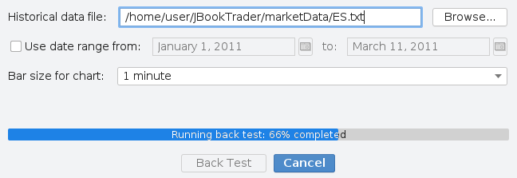
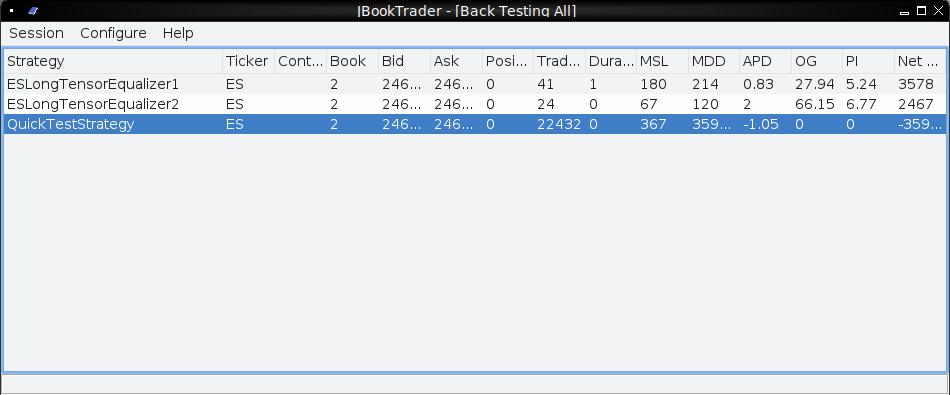
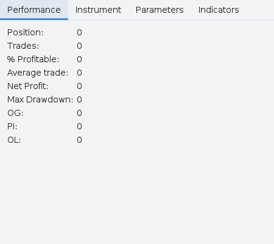
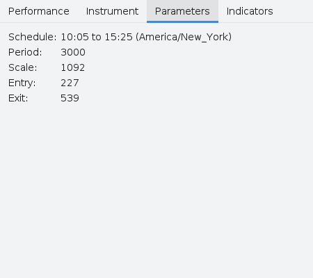
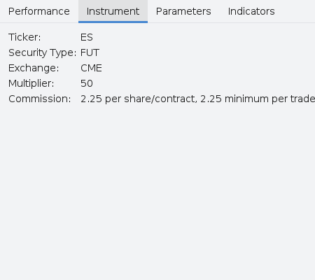

# JBookTrader Quick Start

This guide gets you from a fresh checkout to a backtest on bundled
historical data in about ten minutes. It does **not** require an
Interactive Brokers account or a market-data subscription — those are only
needed for live and forward-test modes (covered at the end).

## 1. Prerequisites

- **JDK 21** or later. Verify with `java -version`.
- **Apache Maven 3.x**. Verify with `mvn --version`.
- ~250 MB of free disk space for the first build (Maven downloads
  dependencies into `~/.m2`).
- A graphical desktop. JBookTrader is a Swing application; there is no
  headless mode.
- *(Optional, only for live/paper-trade)* An Interactive Brokers brokerage
  account with **Trader Workstation (TWS)** or **IB Gateway** installed,
  plus a **Level 2 / market-depth** subscription for every instrument you
  plan to trade.

The codebase has been built with OpenJDK 21.0.10 + Maven 3.9.11 on Linux.

## 2. Clone

```sh
git clone https://github.com/nonlinear5/jbooktrader.git
cd jbooktrader
```

## 3. Install the TWS API jar into your local Maven repo

The TWS API jar is not on Maven Central. JBookTrader vendors version 10.45
under `lib/`; install it into your local repository so the build can
resolve it:

```sh
mvn install:install-file \
    -Dfile=lib/TwsApi-10.45.jar \
    -DgroupId=com.ib \
    -DartifactId=twsapi \
    -Dversion=10.45 \
    -Dpackaging=jar
```

You only need to do this once per machine (or once per CI image).

## 4. Build a runnable fat jar

```sh
mvn clean package -DskipTests
```

The output is `target/JBookTrader.jar`, an assembly that bundles every
dependency. Maven also produces a thinner `target/jbooktrader-*.jar` next
to it — ignore that one; the runnable artifact is `JBookTrader.jar`.

## 5. First launch

```sh
java --enable-native-access=ALL-UNNAMED -jar target/JBookTrader.jar
```

The main window opens and lists the two bundled sample strategies,
`ESLongTensorEqualizer1` and `ESLongTensorEqualizer2`:


> **Always run JBookTrader from the project root.** It looks for
> `marketData/`, `reports/`, and `src/main/resources/` relative to the
> current working directory. Launch from anywhere else and resource icons
> won't load and the historical data file picker will open in the wrong
> directory. (`Dispatcher.init()` will create `reports/` and
> `marketData/` if they don't already exist.)

## 6. Run your first backtest

JBookTrader ships with one historical data file:
`marketData/ES.txt` — about 5 days of 1-second snapshots of the CME ES
(S&P 500 E-mini) future from late November/early December 2018, about 16
MB.

1. Right-click `ESLongTensorEqualizer1` in the main window.
2. Click **Back test this strategy**.

   

3. Click **Browse…** next to *Historical data file* and pick
   `marketData/ES.txt`.
4. Leave *Use date range from* unchecked, leave *Bar size for chart* at
   `1 minute`.
5. Click **Back Test**.

   A progress bar shows how far through the file you are:

   

6. When it finishes, the strategy row in the main window shows the result
   columns (Trades, MSL, MDD, APD, OG, PI, Net Profit, …):

   

7. Right-click the strategy again and pick **Chart** to view the
   performance chart — price + trade markers on top, the strategy's
   indicators in the middle, cumulative net profit on the bottom.

   

## 7. Inspect a strategy

Right-click any strategy → **Information** to see its trading schedule,
parameter values, instrument and commission, and the indicators it uses:

| Performance                                          | Parameters                                                | Instrument                                                  |
|------------------------------------------------------|-----------------------------------------------------------|-------------------------------------------------------------|
|         |             |           |

## 8. (Optional) Configure your Interactive Brokers connection

If you only want to run backtests, you can skip this. To paper-trade or
trade live, open **Configure → Preferences…** and fill in the **TWS** tab:


| Field      | Typical value                                                   |
|------------|-----------------------------------------------------------------|
| Host       | `localhost` (TWS/IBG running on the same machine)               |
| Port       | `7497` for paper TWS, `4002` for paper IBG, `7496` for live TWS |
| Client ID  | Any unused integer that matches what TWS expects                |
| Account    | Your IB account number, or `edemo` for the IB demo account     |

You must also enable the API in TWS itself (Edit → Global Configuration →
API → Settings → "Enable ActiveX and Socket Clients").

> **Safety tip.** JBookTrader treats any account starting with `D` or `d`,
> or the literal `edemo`, as a paper account; everything else is treated
> as real money. Double-check the **Account** field before you forward- or
> live-trade.

A full walkthrough of all preference tabs (Web Access, Portfolio Manager,
Session Exit, Auto Stop, Notifications) is in the user guide.

## 9. (Optional) Allocate more memory for optimization

The optimizer can run millions of strategy evaluations in one pass. Give
it room:

```sh
java -Xms4g -Xmx10g --enable-native-access=ALL-UNNAMED -jar target/JBookTrader.jar
```

## 10. Where state lives

After a few runs you will see new files appear:

- `reports/<Strategy>.htm` — per-strategy live/forward-test log.
- `reports/<Strategy>Optimizer.htm` — top 100 results of an optimization.
- `reports/EventReport.htm` — chronological event log.
- `marketData/<ticker>.txt` — recordings of live data (only created if
  you run in Trade or ForwardTest mode and the snapshot writer is active).
- User preferences are stored at the OS level via
  `java.util.prefs.Preferences` under
  `com.jbooktrader.JBookTrader` — on Linux that's
  `~/.java/.userPrefs/com/jbooktrader/JBookTrader/`. There is no local
  config file.

`$TMPDIR/JBookTrader.lock` is the inter-process lock used to refuse a
second instance; it is removed on a clean exit. If a crash leaves it
behind, just delete it.

## 11. Troubleshooting

- **"JBookTrader is already running."** — Another instance has the lock,
  or a previous crash left `$TMPDIR/JBookTrader.lock` behind. Kill the
  other process or delete the file.
- **"Could not connect to TWS/IBG."** — TWS or IB Gateway is not running,
  the host/port don't match what TWS expects, or TWS's API is disabled.
  See the TWS configuration document under
  `doc/TWSConfigurationForJBookTader.docx`.
- **WARNING: A restricted method in java.lang.System has been called** —
  Harmless. It comes from one of the bundled dependencies and is silenced
  by `--enable-native-access=ALL-UNNAMED`.
- **Backtest reports "Could not find file: ..."** — The path in the
  *Historical data file* field doesn't exist. Use **Browse…**.
- **Optimizer finishes with no rows in the results table** — Likely your
  *Min trades* threshold is higher than what any parameter set produced
  on the selected data range. Lower it on the Optimizer dialog.
