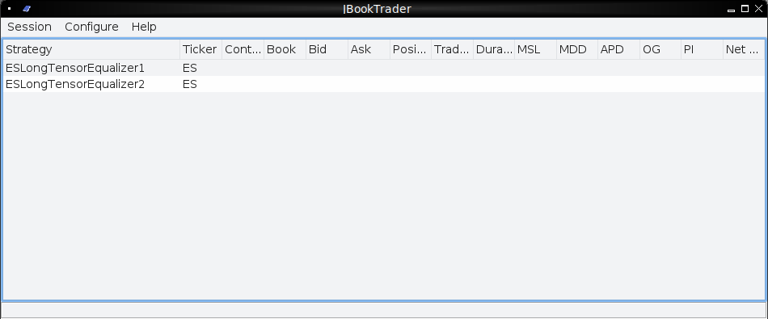
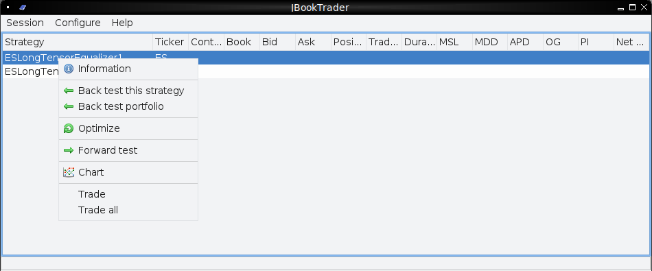
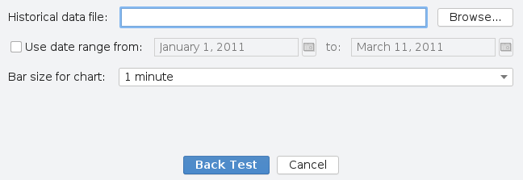
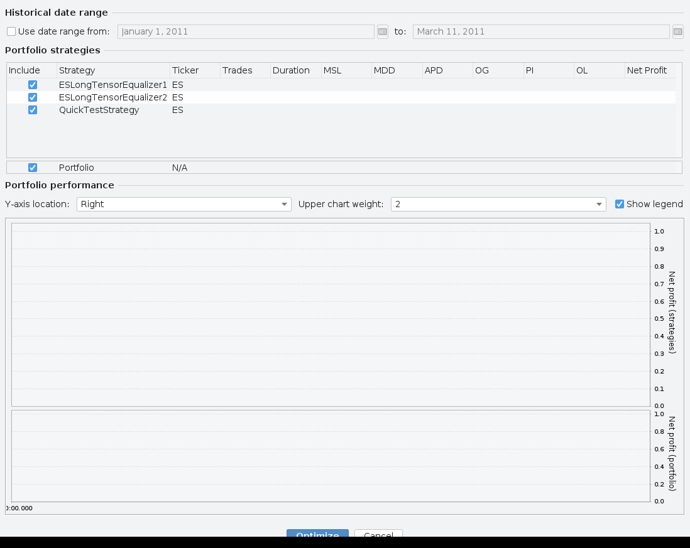
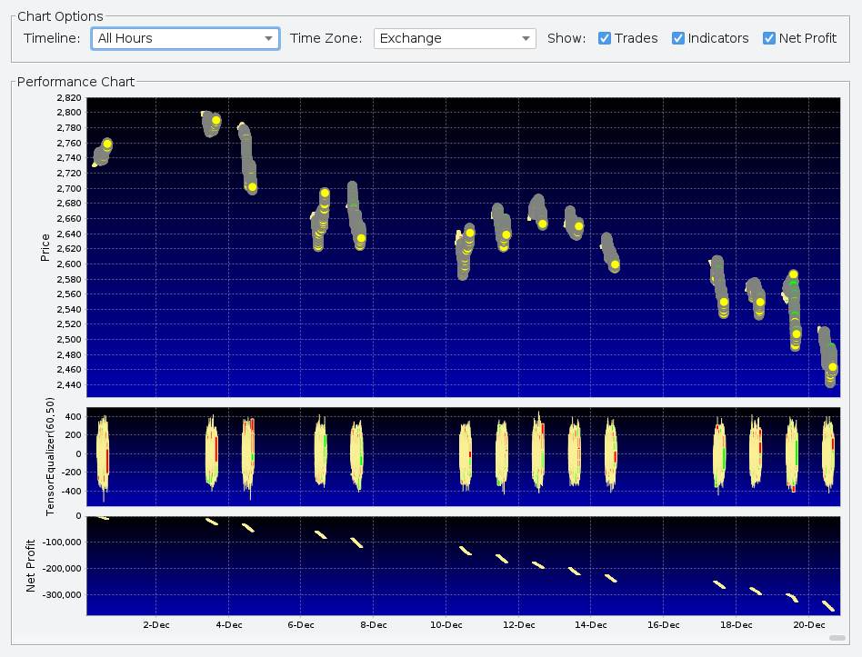
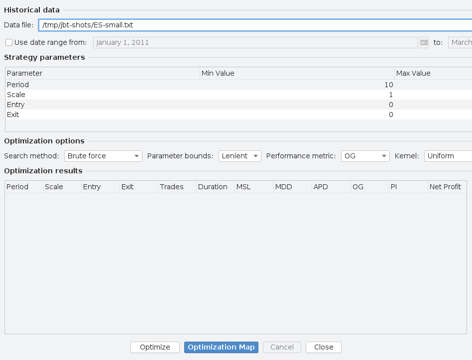
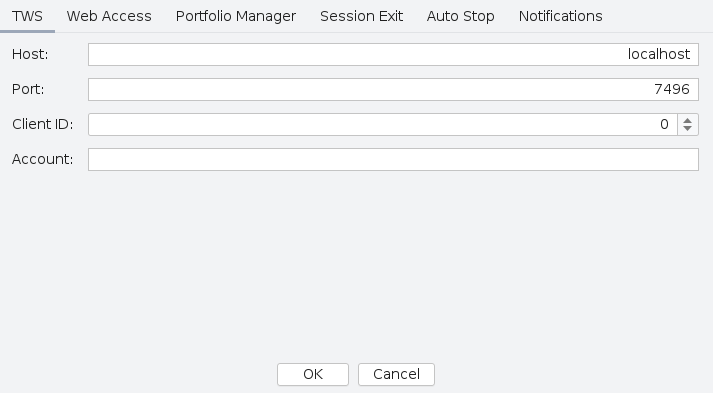
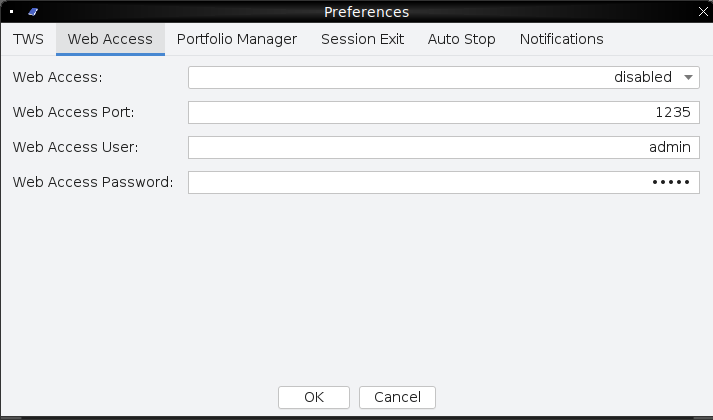
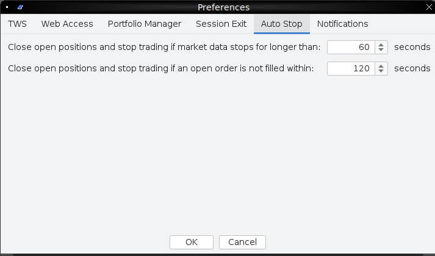
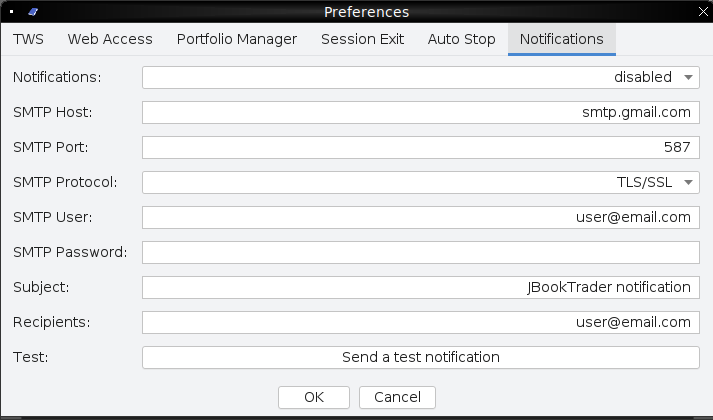

# JBookTrader User Guide

This document is the long-form reference for everything that is
user-visible in JBookTrader: every menu item, dialog, preference, mode,
backtest knob, optimizer option, and on-disk artifact. Use the
[Quick Start](QUICKSTART.md) first if you haven't built and launched the
app yet, and the [Architecture](ARCHITECTURE.md) document if you want to
understand what's happening under the hood.

---

## Contents
- [1. The main window](#1-the-main-window)
- [2. Operational modes](#2-operational-modes)
- [3. Per-strategy actions (right-click)](#3-per-strategy-actions-right-click)
- [4. Backtesting](#4-backtesting)
- [5. Portfolio backtesting](#5-portfolio-backtesting)
- [6. Performance chart](#6-performance-chart)
- [7. Optimization](#7-optimization)
- [8. Forward testing and live trading](#8-forward-testing-and-live-trading)
- [9. Preferences reference](#9-preferences-reference)
- [10. Trading schedule, holidays, contract roll](#10-trading-schedule-holidays-contract-roll)
- [11. Recording market data](#11-recording-market-data)
- [12. Web monitoring server](#12-web-monitoring-server)
- [13. Email notifications](#13-email-notifications)
- [14. Reports & on-disk state](#14-reports--on-disk-state)
- [15. Performance metrics, defined](#15-performance-metrics-defined)
- [16. Writing your own strategy or indicator](#16-writing-your-own-strategy-or-indicator)
- [17. Auto-start and headless trading](#17-auto-start-and-headless-trading)

---

## 1. The main window



The main window has three areas:

- **Menu bar** with three menus:
  - **Session** → *Suspend trading* (only enabled in Trade mode — flips
    to Force-Close mode and flattens all positions), *Exit* (prompts for
    confirmation and quits cleanly).
  - **Configure** → *Preferences…* — see [§9](#9-preferences-reference).
  - **Help** → *User Manual*, *Release Notes*, *Discussion Group*,
    *Project Home*, *About*. The first four open external URLs.

- **Strategy table** lists every class that `StrategyLoader` discovered.
  Columns: Strategy, Ticker, Contract (the IB local symbol once known),
  Book balance, Bid, Ask, Position, Trades, average trade Duration, Max
  Single Loss, Max DrawDown, APD, OG, PI, Net Profit. Columns update live
  during backtests, forward tests, and live trading.

- **Status bar** at the bottom shows a single-line message; the window
  title shows the current mode and (in Trade/ForwardTest/ForceClose) the
  account summary returned by `OrderManagerAssistant.getSystemStatus()`.

The strategy table only accepts **single** row selection at a time.
Middle- or right-click pops up the action menu (see §3).

## 2. Operational modes

JBookTrader is always in exactly one of these modes:

| Mode             | Entered by                                                                  | Side effects                                                                                            |
|------------------|------------------------------------------------------------------------------|---------------------------------------------------------------------------------------------------------|
| `Trade`          | Right-click → Trade, Trade all, or `java -jar ... true`                      | Connects to TWS, subscribes to market depth, starts watchdogs, starts monitoring HTTP server if enabled |
| `ForwardTest`    | Right-click → Forward test                                                   | Connects to TWS, subscribes to market depth, but orders are simulated locally                          |
| `ForceClose`     | Session → Suspend trading, or a watchdog trips                               | Sends real orders **only** if the previous mode was `Trade`; otherwise simulates; closes positions     |
| `BackTest`       | Right-click → Back test this strategy                                        | Disconnects from TWS                                                                                    |
| `BackTestAll`    | Right-click → Back test portfolio                                            | Disconnects from TWS                                                                                    |
| `Optimization`   | Right-click → Optimize                                                       | Disconnects from TWS, **disables event reporting** during the run                                       |

Trade-related menu items are mutually disabled when they shouldn't be
available: e.g. you cannot start a backtest while in Trade mode, nor
forward-test while live-trading.

## 3. Per-strategy actions (right-click)



| Item                       | What it does                                                                                       |
|----------------------------|-----------------------------------------------------------------------------------------------------|
| **Information**            | Opens the four-tab info dialog (Performance, Instrument, Parameters, Indicators).                  |
| **Back test this strategy**| Opens the [Back Test dialog](#4-backtesting) for the selected strategy only.                       |
| **Back test portfolio**    | Opens the [Portfolio Back Test dialog](#5-portfolio-backtesting) across all strategies.            |
| **Optimize**               | Opens the [Optimizer dialog](#7-optimization) for the selected strategy.                           |
| **Forward test**           | Starts forward-testing the selected strategy — connects to TWS, subscribes to data, simulates orders. |
| **Chart**                  | Shows the [Performance chart](#6-performance-chart) for the most recent backtest of this strategy. |
| **Trade**                  | Live-trades the selected strategy. **Real orders go to your IB account.**                          |
| **Trade all**              | Live-trades every loaded strategy at once.                                                         |

Forward test / Trade / Trade all are intentionally greyed out unless we
are already in a compatible mode (see §2).

## 4. Backtesting



| Field                  | Meaning                                                                                                                                                                                                                                                       |
|------------------------|--------------------------------------------------------------------------------------------------------------------------------------------------------------------------------------------------------------------------------------------------------------|
| Historical data file   | A `.txt` file in the JBookTrader snapshot format (see [§11](#11-recording-market-data)). The starting directory defaults to `<JBT home>/marketData/`.                                                                                                          |
| Use date range from… to | When checked, only snapshots whose date is within `[from, to]` are run. Use `MMMMM d, yyyy` format. Dates are interpreted in the data file's declared time zone.                                                                                              |
| Bar size for chart     | The OHLC bucket size on the performance chart only — does **not** affect the strategy. One of `1s, 5s, 15s, 30s, 1m, 5m, 15m, 30m, 1h, 2h`.                                                                                                                    |

Behavior:
- The snapshot list is parsed into memory once and **cached** by file
  path + size + date filter. Subsequent backtests of the same file are
  much faster.
- During the run, indicator values, position, and trades are computed.
  Strategy results in the main window's row update as soon as the run
  finishes.
- The performance chart data is built during the backtest, so opening
  **Chart** afterwards is instant.
- Cancelling mid-run is safe: results are simply not finalized.

### What a tick actually does

For each snapshot, in order:
1. `MarketBook.setSnapshot(snapshot)` — updates the per-instrument book.
2. `IndicatorManager.updateIndicators()` recomputes every indicator. If
   the previous snapshot was more than 5 minutes ago, all indicators
   reset first. Returns "valid" only after 3 hours of samples
   (`MIN_SAMPLE_SIZE` in `IndicatorManager`).
3. The `TradingSchedule` checks whether `snapshot.getTime()` is inside
   the strategy's `start..end` window for the current day.
4. If valid + in schedule, the strategy's `onBookSnapshot()` runs.
   Otherwise, the strategy is forced flat.
5. `OrderManagerAssistant.trade(strategy)` reconciles the strategy's
   target position against its current position. In backtest mode this
   produces a simulated fill at the expected price (`ask` for BUY, `bid`
   for SELL) — no slippage model is applied.
6. `PerformanceManager.updateMetrics()` is called if there was a position
   open, and `updateOnTrade(...)` runs when a fill completes a position.
7. The model fires `StrategyUpdate`, which refreshes the strategy's row
   in the main window.

At the end, `PerformanceManager.updateAtEnd()` finalizes the
optimal-leverage, OG, and PI scores.

## 5. Portfolio backtesting



Opened from any strategy's right-click → **Back test portfolio**. Every
strategy listed in the main window is shown with an *Include* checkbox;
uncheck the ones you don't want in the portfolio. The strategies you
include run sequentially against the same data, and their trade profits
are aggregated into a single combined equity curve.

Chart options at the top:
- **Y-axis location** — `Left` or `Right`.
- **Upper chart weight** — `1..4`. Controls how much vertical space the
  strategies' equity curves get vs. the portfolio's combined curve.
- **Show legend** — toggles the chart legend.

Behavior:
- The footer row shows aggregate Trades / MSL / MDD / APD / OG / PI / OL
  / Net Profit across the selected strategies.
- A common date range (top of the dialog) filters every strategy.
- The dialog window geometry is persisted as
  `portfolio.optimizerwindow.width/height` so it remembers its layout
  between launches.

## 6. Performance chart



After any backtest, right-click the strategy → **Chart**.

Three stacked panels share a date axis:
1. **Price** — OHLC candles at the chosen bar size, with yellow circles
   marking long-entry fills and green/red triangles for exits (sign
   follows the trade's signed quantity).
2. **One panel per indicator**, labelled with the indicator's key (e.g.
   `TensorEqualizer(3000,1092)`).
3. **Net Profit** — cumulative dollars on the strategy.

Above the chart:
- **Timeline** — `All Hours` (default) or "Trading Hours" — collapse
  outside-of-schedule gaps in the X axis.
- **Time Zone** — `Exchange` (the strategy's schedule TZ) or `Local`.
- **Show** checkboxes — toggle Trades, Indicators, Net Profit panels.

## 7. Optimization



Opens from right-click → **Optimize**. Four sections, top to bottom:

### Historical data
Pick the same kind of file as for backtests, with an optional date range.

### Strategy parameters
A table with one row per parameter the strategy declared. You can edit
**Min Value**, **Max Value**, and (for brute force) **Step**. Defaults
come from the strategy's `setParams()` defaults — for parameters declared
with the two-arg `addParam(name, min, max, value)`, the default step is
`max(1, (max - min) / 5)`, so for a `[10, 10000]` range the default step
is `1998`. Tightening the range is the simplest way to make a brute-force
optimization fit in a reasonable wall-clock.

### Optimization options
| Control            | Choices                                              |
|--------------------|------------------------------------------------------|
| Search method      | `Brute force` / `Divide & Conquer` / `Centroid` / `Gradient` |
| Parameter bounds   | `Lenient` / `Strict` — strict refuses parameter sets where any value lies outside the declared `[min, max]` |
| Performance metric | `Net Profit` / `OG` / `PI` / `APD` (see [§15](#15-performance-metrics-defined)) |
| Kernel             | `Uniform`, `Triangular`, `Epanechnikov`, `Quartic`, `Gaussian` — used by the kernel performance evaluator |
| Inclusion criteria | `Profitable strategies` (default) / `All strategies` |
| Min trades         | Reject parameter sets with fewer trades than this    |
| Advanced…          | Opens **Advanced Optimization Options** — sets `Divide & Conquer coverage` (how many narrowing passes; default 3) and `Strategies per processor` (chunk size for parallel workers; default 50). |

### Optimization results
The bottom half of the dialog shows the top results sorted by the chosen
metric. Click any column header to re-sort.

Buttons:
- **Optimize** — runs the search; the progress bar shows remaining time.
- **Optimization Map** — when two parameters are varied, renders a 2D
  heat-map of the chosen metric across the parameter grid. Useful for
  visualizing flat vs. spiky parameter landscapes.
- **Cancel** — interrupts the run; partial results are kept.
- **Close** — closes the dialog (also cancels any running optimization).

The dialog persists its window geometry as `optimizerwindow.width/height`
and remembers the file path, date filter, performance metric, kernel,
inclusion criteria, parameter bounds, and last search method.

The top 100 results are also written to
`reports/<Strategy>Optimizer.htm`.

### Optimization search methods, in plain English

- **Brute force.** Cartesian product of every `(min..max step ...)` per
  parameter. With four parameters at step 5 each, that's 625 candidates;
  at step 10 it's already 10 000.
- **Divide & Conquer.** Run brute force, find the best, recenter the
  ranges around it, halve the step, repeat `DivideAndConquerCoverage`
  times (default 3). Much faster than naive brute force on smooth
  landscapes.
- **Centroid.** A Nelder-Mead-style downhill simplex that walks the
  centroid of the best-so-far points. Doesn't require step sizes.
  Strong on smooth landscapes, weak on spiky ones.
- **Gradient.** Local hill-climb. Cheap; good for a final polish on top
  of a Brute Force or Divide & Conquer winner.

### Resource hints

- Each candidate constructs a fresh `Strategy`, attaches an
  `IndicatorManager`, replays the whole snapshot list, and scores it.
  CPU time scales **linearly** with the number of snapshots and the
  number of candidates.
- Workers run on a thread pool of size `availableProcessors + 1`, with
  batch size `StrategiesPerProcessor` (default 50). On a 16-core box that
  means up to 17 strategies replay in parallel, so RAM usage during big
  brute-force runs can be significant — give the JVM 4–16 GB:
  ```sh
  java -Xms4g -Xmx10g --enable-native-access=ALL-UNNAMED -jar target/JBookTrader.jar
  ```

## 8. Forward testing and live trading

### Forward test
Right-click → **Forward test**. JBookTrader connects to TWS, subscribes
to market depth for the strategy's contract, and runs the strategy
against live data — but every "order" is simulated locally at the
expected fill price (ask for BUYs, bid for SELLs). No commissions are
debited from your account; everything is paper math. P&L is reported in
the main window and in `reports/<Strategy>.htm`.

### Trade (live)
Right-click → **Trade** (or **Trade all** from the menu to launch every
strategy in sequence). JBookTrader does the same as forward test, but
sends real `MKT` orders via TWS. Three guard rails apply:

1. **Account check.** If the account configured in
   *Preferences → TWS → Account* is empty, JBookTrader refuses to
   start live trading. If the account starts with `D`/`d` or is
   literally `edemo`, it is treated as paper; anything else is treated
   as live.
2. **Leverage gate.** `PortfolioManager.isWithinMaxLeverage()` blocks any
   order that would push aggregate notional exposure above the
   `MaxLeverage` preference (default `10`).
3. **Watchdogs.**
   - *Market data timeout* — if no snapshot arrives for
     `MarketDataTimeoutSeconds` (default 60) while inside the trading
     window, JBookTrader flips to ForceClose.
   - *Open order timeout* — if a submitted order isn't filled within
     `OpenOrderTimeoutSeconds` (default 120), it triggers ForceClose.
   - *Critical exception* — any uncaught exception during snapshot
     processing also flips to ForceClose.

### Suspending live trading
*Session → Suspend trading* asks for confirmation, then sets mode to
`ForceClose`. Open positions are flattened on the next snapshot; after
that, the strategy is dormant. To resume, restart JBookTrader and
re-arm.

### Session exit time
*Preferences → Session Exit* configures a daily auto-shutdown.
`ExitScheduler` starts the moment you enter Trade or ForwardTest mode and
calls `Dispatcher.exit() + System.exit(0)` at the configured wall-clock
time. Default `17:00`.

## 9. Preferences reference

Open **Configure → Preferences…**. Six tabs.

### TWS



| Preference | Default     | Meaning                                                                                  |
|------------|-------------|-------------------------------------------------------------------------------------------|
| Host       | `localhost` | Host where TWS/IBG accepts API connections.                                              |
| Port       | `7496`      | TWS live = 7496, TWS paper = 7497, IBG live = 4001, IBG paper = 4002.                    |
| Client ID  | `0`         | Any unused integer that TWS allows. Use distinct IDs if multiple clients connect to TWS. |
| Account    | *(empty)*   | IB account number. `edemo` or any account starting with `D` is treated as paper.         |

### Web Access



See [§12](#12-web-monitoring-server) below.

### Portfolio Manager

| Preference         | Default | Meaning                                                       |
|--------------------|---------|----------------------------------------------------------------|
| Maximum leverage   | `10`    | Hard cap on aggregate notional exposure / account value.       |

### Session Exit

| Preference         | Default | Meaning                                                |
|--------------------|---------|--------------------------------------------------------|
| Exit Time (HH:MM)  | `17:00` | Wall-clock time at which JBookTrader auto-exits when in Trade or ForwardTest mode. |

### Auto Stop



| Preference                                                                        | Default | Meaning |
|-----------------------------------------------------------------------------------|---------|---------|
| Close open positions and stop trading if market data stops for longer than (sec)  | `60`    | Market-data watchdog timeout. |
| Close open positions and stop trading if an open order is not filled within (sec) | `120`   | Open-order watchdog timeout.  |

Both watchdogs only act inside the strategy's trading schedule.

### Notifications



See [§13](#13-email-notifications).

### Preferences that are not in the dialog

`JBTPreferences` also stores window geometry, last-used backtest data
file path, last-used date range, last-used optimization metric, kernel,
inclusion criteria, parameter bounds, optimization-map dimensions, and
performance-chart bar size. These are written automatically when the
relevant dialog is closed; if you ever want to reset them, delete the
`com.jbooktrader.JBookTrader` node from your Java prefs store
(on Linux: `~/.java/.userPrefs/com/jbooktrader/JBookTrader/`).

## 10. Trading schedule, holidays, contract roll

### Trading schedule
Every strategy hard-codes a `TradingSchedule(startTime, endTime,
timeZone)` in its base class — for the bundled ES strategies that's
`10:05–15:25 America/New_York`. Outside that window the strategy is
forced flat. Examples of valid time-zone strings:
`America/New_York`, `America/Chicago`, `Europe/London`, `Asia/Singapore`.

If you want a different schedule for one of the bundled strategies,
subclass its base (e.g. `StrategyES`) and call
`setStrategy(contract, new TradingSchedule(...), multiplier, commission)`.

### Holiday / end-of-year
`HolidaySchedule` and `EndOfYearSchedule` are baked into `DaySchedule`
and tell `StrategyRunner` when to reset indicators and stop trading on
exchange holidays. They aren't user-configurable in the current build —
edit the source if you need to.

### Contract roll
For futures, JBookTrader doesn't know the front month up-front. When you
forward- or live-trade an `FUT` contract, it requests `contractDetails`
from TWS for the symbol, throws away expirations more than one year out,
and then waits for `tickSize` callbacks; once three candidate expirations
have reported volume and one of them clears a 10 000-contract liquidity
threshold, that becomes the chosen `localSymbol` used for orders. Roll
happens automatically when volume migrates to the next month.

## 11. Recording market data

The same per-second `MarketSnapshot` format used by backtesting is what
`SnapshotWriterManager` writes when JBookTrader is in `Trade` or
`ForwardTest` mode. Files land at `marketData/<localSymbol>.txt`. Each
file is created lazily the first time a snapshot for that contract is
recorded, between **07:00 and 16:00** (`new TimeFilter(7, 16)` in
`SnapshotWriterManager`). The format:

```
# header (8 lines of comments) + a `timeZone=...` line
MMddyy,HHmmss,balance,bid,ask,volume
```

Examples of how to use these files:
- **Iterate on a strategy** without paying for IB market data twice:
  record once, then backtest forever.
- **Run optimizations** on data you actually saw rather than vendor
  data. Backtest results are always closer to reality if you optimize on
  the same data feed the strategy will trade on.

The bundled `marketData/ES.txt` is an example file you can study.

## 12. Web monitoring server

Enable on the **Web Access** tab. When enabled, JBookTrader starts an
embedded HTTP server on `WebAccessPort` (default `1235`) the moment
it enters Trade or ForwardTest mode. HTTP Basic auth uses the configured
user/password.

| Preference        | Default      |
|-------------------|--------------|
| Web Access        | `disabled`   |
| Web Access Port   | `1235`       |
| Web Access User   | `admin`      |
| Web Access Password | `admin`    |

The server serves:
- `/` — an HTML status table of every running strategy (ticker, price,
  position, trades, net profit). Strategy names link to per-strategy
  HTML reports.
- `/*.htm` — files from `reports/`.
- everything else — from `src/main/resources/` (CSS, favicon, logo).

> **Network safety.** The credentials are plain HTTP Basic, the server
> listens on all interfaces, and there is no rate limiting. Don't put
> this on the public internet without a reverse proxy that adds TLS and
> something more serious than user/password auth. If you're trading from
> home, port-forwarding it is fine; just change the default
> `admin`/`admin`.

## 13. Email notifications

When `Notifications=enabled` and Trade or ForwardTest mode is active,
JBookTrader emails the configured recipients on every trade event. The
SMTP fields on the Notifications tab follow Jakarta Mail conventions —
SSL or TLS/SSL, port 465/587, etc. The **Test** button sends a one-line
test message immediately.

| Preference     | Default                  |
|----------------|--------------------------|
| Notifications  | `disabled`               |
| SMTP Host      | `smtp.gmail.com`         |
| SMTP Port      | `587`                    |
| SMTP Protocol  | `TLS/SSL`                |
| SMTP User      | `user@email.com`         |
| SMTP Password  | *(empty)*                |
| Subject        | `JBookTrader notification` |
| Recipients     | `user@email.com`         |

The notifier dispatches mails asynchronously on its own executor — slow
SMTP servers don't block trading.

## 14. Reports & on-disk state

All under `<JBT home>/reports/`:

| File                                | Written by                       | Contents                                                                |
|-------------------------------------|----------------------------------|-------------------------------------------------------------------------|
| `EventReport.htm`                   | `EventReport` (all modes)        | Chronological event log; everything that goes through `report(...)`.    |
| `<Strategy>.htm`                    | `StrategyReport`                 | Per-strategy live/forward-test log.                                     |
| `<Strategy>Optimizer.htm`           | `OptimizationReport`             | Top 100 results of the most recent optimization, sorted by chosen metric. |

And under `<JBT home>/marketData/`:

| File                          | Written by                              | Contents                                  |
|-------------------------------|------------------------------------------|--------------------------------------------|
| `<localSymbol>.txt`           | `SnapshotWriter` (Trade / ForwardTest)   | Recorded `MarketSnapshot`s for that symbol |

User preferences are stored in the OS-level Java preferences store under
`com.jbooktrader.JBookTrader`. Reset to defaults by removing that node.

`$TMPDIR/JBookTrader.lock` is the single-instance lock; removed on clean
exit. Safe to delete manually if a crash leaves it behind.

## 15. Performance metrics, defined

The metrics that show up in the strategy table, the strategy info dialog,
and the optimizer results table:

| Code      | Long name                  | Definition (see `PerformanceManager` and `PerformanceEvaluator`)                                                                                              |
|-----------|----------------------------|---------------------------------------------------------------------------------------------------------------------------------------------------------------|
| Trades    | Trades                     | Count of completed round-trip trades.                                                                                                                         |
| Duration  | Avg duration (min)         | `timeInMarket / trades`, in minutes.                                                                                                                          |
| MSL       | Max single loss            | Absolute value of the worst single round-trip P&L.                                                                                                            |
| MDD       | Max drawdown               | Peak-to-trough net-profit drop across the run.                                                                                                                |
| APD       | Average profit-to-drawdown | `netProfit / cumulativeIntraTradeDrawdown` — a hand-rolled ratio of total gain to total intra-trade pain.                                                     |
| OG        | Optimal growth             | `PI * APD * sqrt(numTrades)` (only positive when `pi > 0 && apd > 0`). Aggregates expectancy, robustness, and sample size; favored as the default optimizer metric. |
| PI        | Performance index          | `PerformanceEvaluator.getPi()` from the per-trade return distribution. Higher is better.                                                                       |
| OL        | Optimal leverage           | `PerformanceEvaluator.getOptimalLeverage()` — Kelly-style optimal leverage.                                                                                    |
| Net Profit| Net profit                 | `totalSold - totalBought + positionValue - totalCommission`.                                                                                                  |

Per-trade return is `tradeProfit / (avgFillPrice * multiplier)`.

## 16. Writing your own strategy or indicator

### New strategy

Drop a class into `src/main/java/com/jbooktrader/strategy/`:

```java
package com.jbooktrader.strategy;

import com.jbooktrader.indicator.combo.TensorEqualizer;
import com.jbooktrader.platform.optimizer.StrategyParams;
import com.jbooktrader.strategy.base.StrategyES;

public class MyESStrategy extends StrategyES {
    private static final String PERIOD = "Period";
    private static final String SCALE  = "Scale";
    private static final String ENTRY  = "Entry";
    private static final String EXIT   = "Exit";

    private TensorEqualizer tensorEqualizer;
    private final int entry, exit;

    public MyESStrategy(StrategyParams params) {
        super(params);
        entry = getParam(ENTRY);
        exit  = getParam(EXIT);
    }

    @Override public void setParams() {
        addParam(PERIOD, 100, 5000, 1000);
        addParam(SCALE,    1, 2000,  500);
        addParam(ENTRY,    0, 1000,  200);
        addParam(EXIT,     0, 1000,  500);
    }

    @Override public void setIndicators() {
        tensorEqualizer = (TensorEqualizer) addIndicator(
            new TensorEqualizer(getParam(PERIOD), getParam(SCALE))
        );
    }

    @Override public void onBookSnapshot() {
        if (tensorEqualizer.getTension() <= exit) {
            goFlat();
        } else if (tensorEqualizer.getSigmaTension() >= entry) {
            goLong(1);
        }
    }
}
```

Build and restart — JBookTrader picks it up automatically.

If your strategy needs a different instrument, subclass `StrategyES` (or
`StrategyNG`, `StrategyCL`, …) or create a fresh base that calls:

```java
setStrategy(
    ContractFactory.makeFutureContract("ES", "CME"),
    new TradingSchedule("10:05", "15:25", "America/New_York"),
    50,  // contract multiplier
    CommissionFactory.getBundledNorthAmericaFutureCommission()
);
```

> **Watch out.** Strategy classes are discovered by **classpath
> scanning**; `StrategyLoader` invokes the `(StrategyParams)` constructor
> reflectively. If your strategy's constructor throws (e.g. because a
> parameter is missing), JBookTrader will refuse to start and surface the
> error in a message dialog. The constructor must succeed for an empty
> `StrategyParams` (in which case `setParams()` is invoked to populate
> defaults).

### New indicator

```java
public class MyIndicator extends Indicator {
    public MyIndicator(int period) { super(period); }
    @Override public void calculate() {
        MarketSnapshot s = marketBook.getSnapshot();
        // ... read s.getBalance(), s.getPrice(), s.getVolume()
        value = ...; // value shows up on the performance chart
    }
    @Override public void reset() { /* clear state */ }
}
```

Register from your strategy's `setIndicators()` via `addIndicator(new
MyIndicator(100))`. Two strategies sharing the same indicator
constructor parameters automatically share the same instance.

## 17. Auto-start and headless trading

Passing a single argument of `true` to `main()` puts JBookTrader into
Trade mode automatically and adds **every loaded strategy** to the order
manager:

```sh
java --enable-native-access=ALL-UNNAMED -jar target/JBookTrader.jar true
```

Useful for unattended boots, e.g. on a trading box that wakes up before
market open. Pair this with *Session Exit* to get a clean shutdown at
the end of the day. JBookTrader still opens its main window (it is a
Swing app), so the host must have a graphical display — use Xvfb or
similar on a headless server.

A typical setup:

```sh
# In a systemd unit, supervisor, etc.:
Xvfb :99 -screen 0 1280x900x24 &
DISPLAY=:99 java -Xms2g -Xmx4g --enable-native-access=ALL-UNNAMED \
    -jar /opt/jbooktrader/target/JBookTrader.jar true
```

Combined with the web monitoring server, you can babysit the running
session from a browser or phone.
